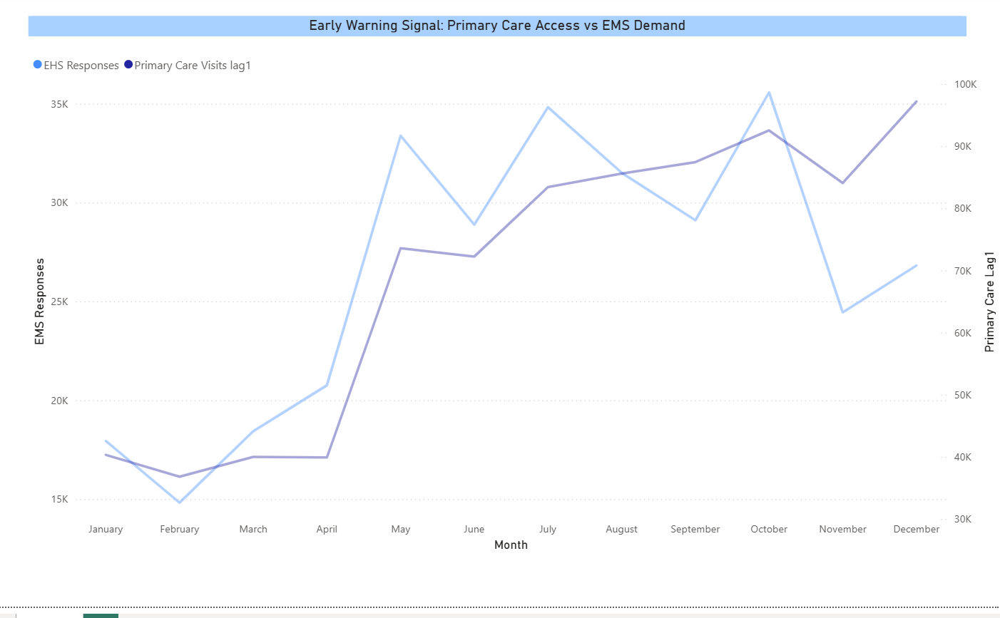

# Nova Scotia Health System Pressure Early Warning Modeling

## Overview

This project analyzes the relationship between upstream primary care access activity and downstream Emergency Health Services demand across Nova Scotia health zones.

The objective is to evaluate whether changes in alternative primary care delivery channels can function as a leading indicator of acute system pressure and support early warning and resource planning decisions.

This capstone demonstrates an end-to-end analytics workflow including:

- Data processing and feature engineering
- Signal construction
- Predictive modeling
- Visualization in Power BI
- Version control using Git and GitHub

---

## Problem Definition

Alternative primary care channels such as community clinics, pharmacies, mobile clinics, virtual care, and urgent treatment centres often expand in response to attachment gaps and unmet demand.

These services absorb patients who cannot access attached primary care. If upstream access activity changes precede downstream EMS demand spikes, they may function as an observable proxy for system strain.

This project evaluates the following question:

**Can primary care access activity help anticipate high EMS demand months across Nova Scotia health zones?**

A useful outcome would allow health planners to identify elevated system pressure earlier and allocate resources more effectively.

---

## Project Structure

ns-health-signals/
│
├── data_raw/
├── data_processed/
├── notebooks/
│ ├── 01_primary_care_signal.ipynb
│ ├── 02_ehs_demand_signal.ipynb
│ ├── 03_merge_signals.ipynb
│ └── 04_modeling.ipynb
│
├── PowerBI/
│ └── dashboard_preview.png
│
└── README.md

---

# Data Processing

## 1. Primary Care Access Signal

Dataset: Nova Scotia Open Data  
**Accessing Primary Care in Nova Scotia**

Steps performed:

- Filtered visit based measures
- Cleaned numeric fields
- Aggregated monthly visits by health zone

Engineered features:

- Three month rolling mean
- Month over month percent change

Output:

data_processed/primary_care_access_activity_ns.csv

---

## 2. EMS Demand Signal

Dataset: Nova Scotia Emergency Health Services

Steps performed:

- Filtered EHS response counts
- Cleaned numeric formatting
- Aggregated monthly responses by health zone

Engineered features:

- Three month rolling mean
- Percent change
- Z score standardization

Output:

data_processed/ehs_demand_ns.csv

---

## 3. Signal Integration

Merged primary care and EMS signals on:

- Zone
- Date (monthly)

Output:

data_processed/system_signals_merged_ns.csv

---

# Machine Learning Early Warning Model

## Target Definition

Each zone-month classified as:

- **1** = High EMS demand month
- **0** = Typical demand month

High demand defined as EMS responses above the zone specific **75th percentile**.

---

## Feature Engineering

Included:

- Primary care visit counts
- Rolling averages
- Percent change
- One month lagged features to simulate early warning context

---

## Model

Logistic Regression with balanced class weights.

Reason for selection:

- Interpretability
- Small dataset robustness
- Clear probabilistic outputs

---

## Performance (Test Set)

- Accuracy approximately **0.65**
- Precision approximately **0.41**
- Recall approximately **0.88**
- F1 Score approximately **0.56**

The model identifies many high demand months but also produces false positives, suggesting that primary care access alone does not fully explain EMS pressure variation.

---

# Power BI Visualization

A Power BI dashboard was created to visually examine the temporal relationship between upstream primary care access activity and downstream EMS demand.

The visualization shows:

- Rapid growth in alternative primary care utilization
- Comparatively stable EMS demand
- Divergence between upstream and downstream signals

This supports the modeling finding that primary care access signals alone only partially explain EMS pressure.

---

## Dashboard Visualization

---

# Interpretation

Primary care access activity demonstrates measurable association with EMS demand but does not independently predict acute system pressure.

This suggests:

- Additional upstream indicators may be required
- Socioeconomic, demographic, or seasonal variables may strengthen predictive performance
- Multi signal health system modeling is a promising direction

---

# Tools and Technologies

- Python
- pandas
- matplotlib
- scikit-learn
- Jupyter Notebook
- Power BI
- Git and GitHub
- Logistic Regression classification

---

# AI Assistance

AI tools were used to assist with brainstorming, debugging code, structuring the analytics workflow, and improving documentation clarity.  
All modeling logic, interpretation, and validation were reviewed and refined manually.

---

# Reflection

This project demonstrates:

- Building clean time series signals from public health data
- Translating domain assumptions into measurable indicators
- Designing interpretable predictive models
- Communicating findings visually
- Managing a full analytics workflow in version control

Future improvements could include:

- Additional lag structures
- Cross validation
- External demographic features
- Alternative model types such as tree based methods

---

# Author

**Carole Potter**  
Data Analytics Capstone Project  
Nova Scotia
